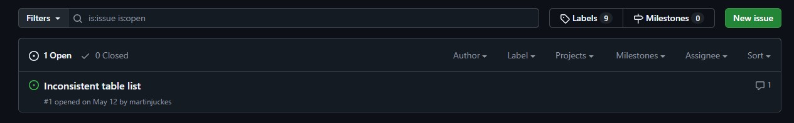
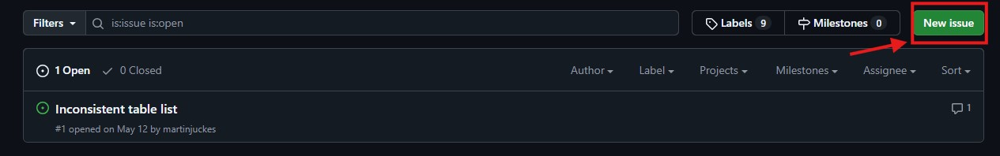

# Regional Aerosol Model Intercomparison Project (RAMIP)

This GitHub repository was created to keep track of issues related to RAMIP datasets.

> Wilcox, L. J., Allen, R. J., Samset, B. H., Bollasina, M. A., Griffiths, P. T., Keeble, J., Lund, M. T., Makkonen, R., Merikanto, J., O'Donnell, D., Paynter, D. J., Persad, G. G., Rumbold, S. T., Takemura, T., Tsigaridis, K., Undorf, S., and Westervelt, D. M.: The Regional Aerosol Model Intercomparison Project (RAMIP), Geosci. Model Dev., 16, 4451–4479, https://doi.org/10.5194/gmd-16-4451-2023, 2023.

## Viewing Current Issues

To view data issues currently present in RAMIP, click on the "Issues" tab of this GitHub Repository.

This will display a list of open issues with a search bar and labels selection as seen below:

## Issue Labels

Issues are either "open", meaning that it is actively impacting RAMIP datasets, or "closed", meanging that it was resolved and does not impact RAMIP datasets. Based on our current framework, most issues will remain open even if the problematic datasets are fixed because many users likely already downloaded them. To distinguish between issues that are unresolved versus fixed, we instead use labels that are assigned to each issue by the repository admins. Additional labels are used to indicate the scope of the issue:

### Severity

`post-processing` - The formatting of the dataset file is inconvenient or incompatible with other datasets, but the underlying data is unaffected.

`coordinate` - The coordinates for a dataset are incompatible with other datasets, improperly formatted, or corrupted, but the underlying variable data is unaffected.

`critical` - The underlying values of the dataset are biased, corrupted, or demonstrably incorrect.

### Status

`source-fixed` - The issue is fixed at the source. Future downloads will be unaffected by the issue.

`post-process-fixed` - The issue is fixed with additional post-processing or data handling.

`resolved` - The issue is fully resolved and does not require any post-processing or modifications to source data.

## Contributing an Issue

If you find an issue not documented in this repo, please add it. To do this, you will need to be logged into a GitHub account. Navigate to the "Issues" page and click on the green button labled "New Issue":

GitHub should automatically prompt what type of issue you want to submit and then autopopulate with a template we created specifically for RAMIP issues. Fill out the template as thoroughly as possible. This will ensure the issue you found is well-documented and easy for others to identify. Note that GitHub currently does not support saving drafts of issues, so be careful not to lose any in-progress work.

## Tests
Python tests are available in `tests/` to be run on individual or multiple netCDF files. They do not catch all issues, but check for the most common ones. Check out `tutorial.ipynb` for how to use it. 

## Credit

This README.md, the issues template, and testing scripts were originally developed by Willow Lin Stenglein, Cameron Cummins, and Sebastian Utama in the Persad Aero-Climate Lab.
